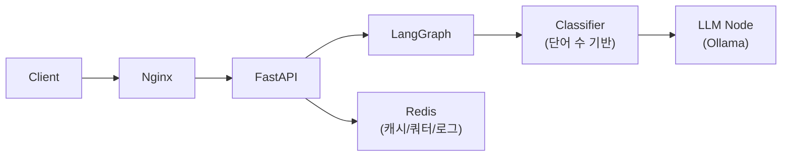
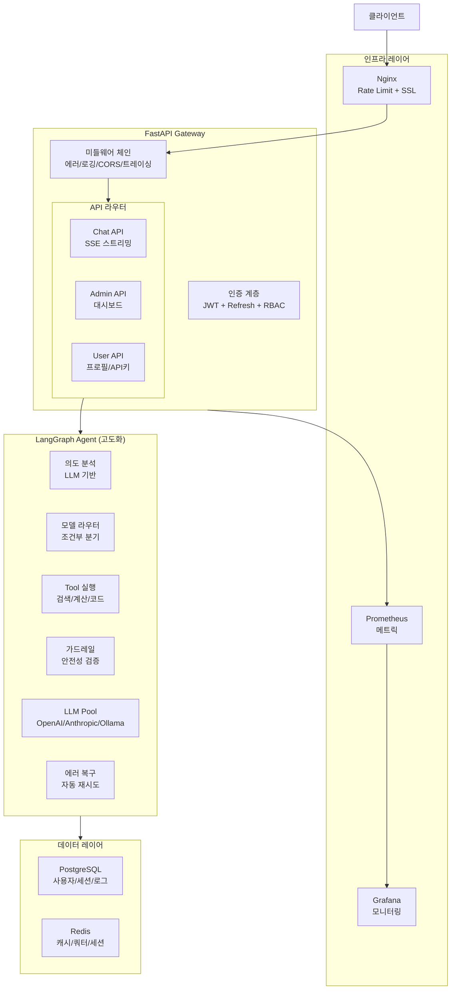
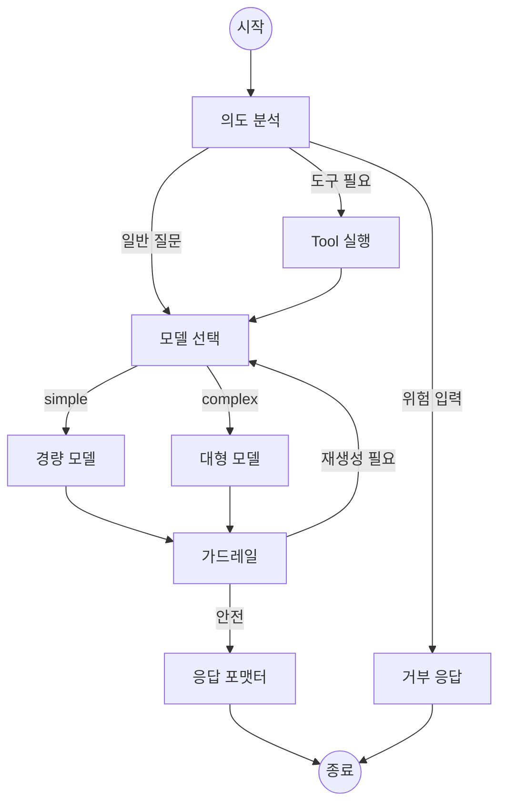

# LLM Gateway 프로젝트 분석 & 실무 수준 구조 제안

## 📊 현재 프로젝트 분석

### 현재 아키텍처



### 파일 구조 (총 17개 소스 파일, ~600줄)

| 모듈 | 파일 | 역할 | 복잡도 |
|------|------|------|--------|
| `core/` | `config.py` | Pydantic Settings | ⭐ |
| | `dependencies.py` | Redis/Ollama 생명주기 | ⭐ |
| | `security.py` | JWT 발행/검증 | ⭐⭐ |
| `agent/` | `graph.py` | LangGraph 선형 2노드 | ⭐ |
| | `state.py` | TypedDict 상태 | ⭐ |
| `agent/nodes/` | `classifier.py` | 단어 수 → 모델 선택 | ⭐ |
| | `llm_node.py` | Ollama API 호출 | ⭐ |
| `router/` | `auth.py` | 로그인 (비밀번호 검증 없음) | ⭐ |
| | `chat.py` | 파이프라인 오케스트레이션 | ⭐⭐ |
| | `admin.py` | 모델 목록 / 사용량 조회 | ⭐ |
| `service/` | `cache_service.py` | MD5 해시 캐시 | ⭐ |
| | `log_service.py` | Redis Pipeline 로깅 | ⭐⭐ |
| | `quota_service.py` | 분당 20회 제한 | ⭐ |

### 현재 한계점 (실무 대비)

> [!WARNING]
> 다음 항목들이 실무 프로젝트와 가장 큰 차이를 만듭니다

| 영역 | 현재 상태 | 실무 기대치 |
|------|----------|------------|
| **인증** | 비밀번호 검증 없음, DB 없이 토큰 발행 | bcrypt 해싱, Refresh Token, RBAC |
| **데이터베이스** | 없음 (모든 데이터 Redis에 저장) | PostgreSQL + Alembic 마이그레이션 |
| **LangGraph** | 선형 2노드 `classifier → llm` | 조건부 분기, 재시도, Tool 사용, 순환 |
| **분류기** | `len(query.split())` 단어 수 기반 | LLM 기반 의도 분석 or Embedding 유사도 |
| **에러 처리** | 개별 try/catch 없음 | 글로벌 미들웨어, 커스텀 예외 계층 |
| **스트리밍** | 미지원 (nginx SSE 설정만 있음) | SSE/WebSocket 실시간 응답 |
| **테스트** | 없음 | pytest + httpx, 통합 테스트 |
| **관찰성** | `print()` 로깅 | structlog + OpenTelemetry 추적 |
| **멀티 프로바이더** | Ollama 단일 | OpenAI / Anthropic / Ollama 통합 |
| **대화 관리** | 단일 질문-응답 | 세션 기반 대화 히스토리 |

---

## 🏗️ 제안하는 실무 수준 아키텍처

### 전체 시스템 구성



### 제안 디렉토리 구조

```
llm-gateway/
├── docker-compose.yml          # PostgreSQL, PGAdmin 추가
├── docker-compose.prod.yml     # 프로덕션 오버라이드
├── .env / .env.example
├── alembic/                    # DB 마이그레이션
│   ├── alembic.ini
│   └── versions/
├── nginx/
│   ├── nginx.conf
│   └── ssl/                    # SSL 인증서
│
├── gateway/
│   ├── main.py                 # 미들웨어 체인 등록
│   ├── requirements.txt
│   ├── Dockerfile
│   │
│   ├── core/                   # 핵심 인프라
│   │   ├── config.py           # 환경별 설정 (dev/staging/prod)
│   │   ├── database.py         # SQLAlchemy async 엔진 + 세션
│   │   ├── dependencies.py     # DI 컨테이너
│   │   ├── security.py         # JWT + Refresh Token + RBAC
│   │   └── exceptions.py       # 커스텀 예외 계층 구조
│   │
│   ├── middleware/              # [NEW] 미들웨어 레이어
│   │   ├── error_handler.py    # 글로벌 에러 핸들링
│   │   ├── logging_mw.py       # 구조화 로깅 (request_id 추적)
│   │   ├── rate_limiter.py     # 계층별 Rate Limiting
│   │   └── tracing.py          # OpenTelemetry 분산 추적
│   │
│   ├── models/                 # [NEW] SQLAlchemy ORM
│   │   ├── user.py             # User + API Key 모델
│   │   ├── conversation.py     # 대화 세션 + 메시지
│   │   ├── usage_log.py        # 토큰 사용량 (영구 저장)
│   │   └── base.py             # 공통 Base + TimestampMixin
│   │
│   ├── schemas/                # Pydantic 스키마 (확장)
│   │   ├── auth.py             # 회원가입/로그인/토큰 갱신
│   │   ├── chat.py             # 스트리밍 이벤트 포함
│   │   ├── conversation.py     # 대화 세션 CRUD
│   │   └── admin.py            # 대시보드 통계
│   │
│   ├── router/                 # API 라우터 (확장)
│   │   ├── auth.py             # 회원가입 + 로그인 + 토큰 갱신
│   │   ├── chat.py             # SSE 스트리밍 + 대화 히스토리
│   │   ├── conversation.py     # [NEW] 세션 관리 CRUD
│   │   ├── admin.py            # 대시보드 + 통계 API
│   │   └── user.py             # [NEW] 프로필 + API 키 관리
│   │
│   ├── service/                # 비즈니스 로직 (확장)
│   │   ├── auth_service.py     # [NEW] bcrypt 해싱 + 토큰 관리
│   │   ├── chat_service.py     # [NEW] 파이프라인 오케스트레이션
│   │   ├── cache_service.py    # 시맨틱 캐시 (유사도 기반)
│   │   ├── quota_service.py    # 계층별 쿼터 (Free/Pro/Enterprise)
│   │   ├── conversation_service.py  # [NEW] 대화 세션 관리
│   │   └── log_service.py      # PostgreSQL 영구 저장 + Redis 캐시
│   │
│   ├── agent/                  # LangGraph (대폭 확장)
│   │   ├── graph.py            # 조건부 분기 + 순환 그래프
│   │   ├── state.py            # 풍부한 상태 (히스토리, 메타데이터)
│   │   └── nodes/
│   │       ├── intent_analyzer.py   # LLM 기반 의도 분석
│   │       ├── model_router.py      # 조건부 모델 라우팅
│   │       ├── llm_node.py          # 멀티 프로바이더 호출
│   │       ├── tool_executor.py     # [NEW] 도구 실행 노드
│   │       ├── guardrail.py         # [NEW] 안전성 검증
│   │       └── response_formatter.py # [NEW] 응답 후처리
│   │
│   ├── providers/              # [NEW] LLM 프로바이더 추상화
│   │   ├── base.py             # 공통 인터페이스 (ABC)
│   │   ├── ollama.py           # Ollama 구현체
│   │   ├── openai.py           # OpenAI 구현체
│   │   └── anthropic.py        # Anthropic 구현체
│   │
│   └── tools/                  # [NEW] Agent 도구
│       ├── base.py             # 도구 인터페이스
│       ├── web_search.py       # 웹 검색
│       ├── calculator.py       # 계산기
│       └── code_executor.py    # 코드 실행 (샌드박스)
│
├── tests/                      # [NEW] 테스트
│   ├── conftest.py             # 픽스처 (TestClient, mock DB)
│   ├── unit/
│   │   ├── test_classifier.py
│   │   ├── test_cache.py
│   │   └── test_quota.py
│   ├── integration/
│   │   ├── test_chat_pipeline.py
│   │   └── test_auth_flow.py
│   └── load/
│       └── locustfile.py       # 부하 테스트
│
├── monitoring/                 # [NEW] 모니터링
│   ├── prometheus.yml
│   └── grafana/
│       └── dashboards/
│
└── docs/                       # [NEW] 문서
    ├── API.md
    └── ARCHITECTURE.md
```

---

## 🎯 단계별 구현 로드맵

실무처럼 **점진적으로** 복잡도를 올리는 것을 권장합니다. 한 번에 모든 것을 바꾸지 않고, 각 단계가 동작하는 상태를 유지하면서 진행합니다.

### Phase 1: 데이터 레이어 확립 (핵심 기반)
**목표**: Redis만 쓰던 구조에서 PostgreSQL을 도입하여 영구 저장소를 확보

| 작업 | 내용 | 배우게 되는 것 |
|------|------|---------------|
| PostgreSQL + Docker | `docker-compose.yml`에 postgres 추가 | 서비스 오케스트레이션 |
| SQLAlchemy Async | `models/`, `core/database.py` 구성 | ORM, async 패턴 |
| Alembic 마이그레이션 | `alembic/` 설정 + 초기 마이그레이션 | 스키마 버전 관리 |
| User 모델 | 비밀번호 해싱 (bcrypt), 회원가입 구현 | 실무 인증 패턴 |

### Phase 2: 인증/인가 고도화
**목표**: 실무 수준의 인증 시스템 구축

| 작업 | 내용 | 배우게 되는 것 |
|------|------|---------------|
| Refresh Token | Access + Refresh 이중 토큰 | 토큰 보안 전략 |
| RBAC | 역할 기반 권한 (`user`, `admin`) | 인가 패턴 |
| API Key 인증 | 서비스 간 인증용 키 발행 | 멀티 인증 방식 |
| 비밀번호 정책 | 강도 검증, 재설정 플로우 | 보안 모범 사례 |

### Phase 3: LangGraph 고도화
**목표**: 선형 그래프를 조건부 분기 + 도구 사용 가능한 에이전트로 확장

| 작업 | 내용 | 배우게 되는 것 |
|------|------|---------------|
| LLM 기반 Intent 분류 | 단어 수 → LLM 프롬프트 기반 의도 분석 | 프롬프트 엔지니어링 |
| 조건부 엣지 | `add_conditional_edges` 활용 | LangGraph 고급 패턴 |
| Tool 사용 | 웹 검색, 계산기 등 도구 통합 | Agent + Tool 패턴 |
| 가드레일 | 프롬프트 인젝션 방어, 출력 필터링 | AI 안전성 |
| 에러 복구 | 재시도 노드, fallback 모델 | 복원력 패턴 |



### Phase 4: 스트리밍 & 대화 관리
**목표**: 실시간 응답 + 멀티턴 대화

| 작업 | 내용 | 배우게 되는 것 |
|------|------|---------------|
| SSE 스트리밍 | `StreamingResponse` + Ollama stream | 서버 전송 이벤트 |
| 대화 세션 | Conversation CRUD + 메시지 히스토리 | 상태 관리 설계 |
| 컨텍스트 윈도우 | 토큰 제한 내 히스토리 관리 | LLM 메모리 전략 |

### Phase 5: 멀티 프로바이더 & 관찰성
**목표**: 프로덕션 수준의 운영 역량

| 작업 | 내용 | 배우게 되는 것 |
|------|------|---------------|
| Provider 추상화 | ABC 기반 인터페이스 + Ollama/OpenAI 구현 | 디자인 패턴 (Strategy) |
| 구조화 로깅 | structlog + request_id 추적 | 운영 로깅 |
| 미들웨어 체인 | 에러/로깅/인증 미들웨어 분리 | 관심사 분리 |
| Prometheus 메트릭 | 요청 수, 지연 시간, 토큰 사용량 | 메트릭 수집 |

### Phase 6: 테스트 & CI/CD
**목표**: 코드 품질 보장 체계

| 작업 | 내용 | 배우게 되는 것 |
|------|------|---------------|
| 단위 테스트 | pytest + mock으로 각 서비스 테스트 | 테스트 설계 |
| 통합 테스트 | TestClient + 실제 Redis/DB | E2E 검증 |
| 부하 테스트 | Locust로 동시 사용자 시뮬레이션 | 성능 테스트 |
| GitHub Actions | 자동 빌드/테스트/린트 파이프라인 | CI/CD |

---

## 💡 권장 시작점

> [!TIP]
> **Phase 1 (데이터 레이어)** 부터 시작하는 것을 강력히 권장합니다.
> 이유: DB가 모든 후속 기능(인증, 대화 관리, 로깅)의 기반이 됩니다.

가장 학습 효과가 높은 순서:
1. **Phase 1** → 실무에서 가장 기본이 되는 DB + ORM
2. **Phase 3** → LangGraph의 진짜 가치를 경험
3. **Phase 4** → 사용자 경험에 직접적인 영향
4. **Phase 2** → 보안은 어느 단계에서든 필요
5. **Phase 5~6** → 운영/품질 역량
