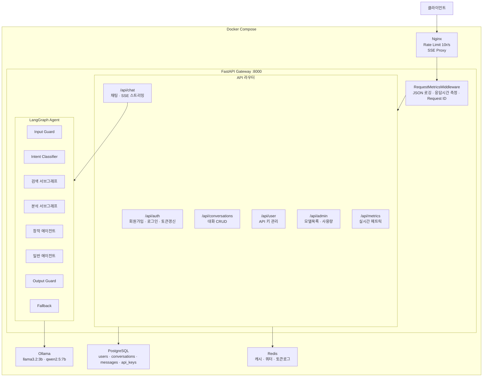
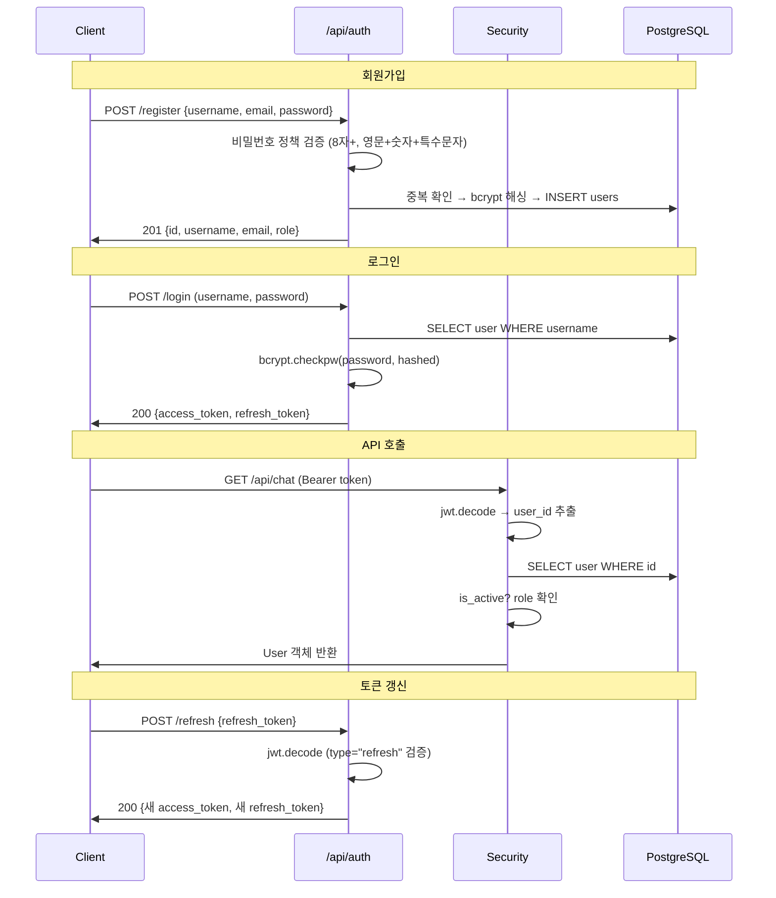
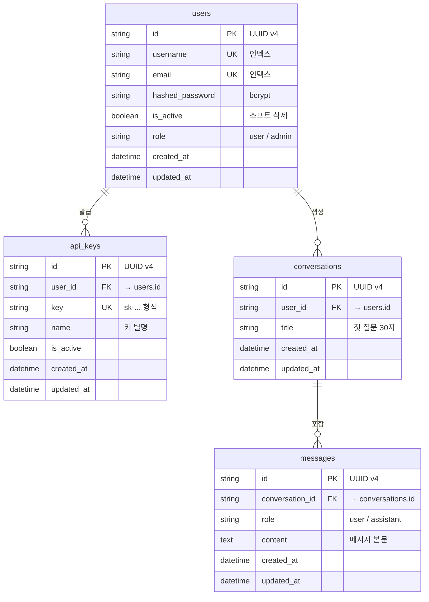
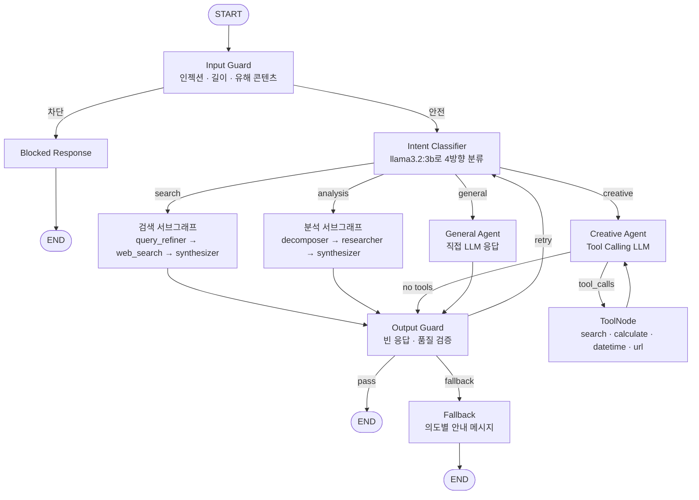
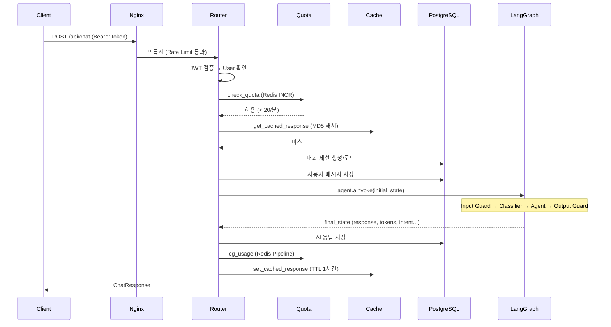

# LLM Gateway — 개발 문서

> **프로젝트**: LangGraph 기반 지능형 LLM 라우팅 게이트웨이  
> **기술 스택**: FastAPI · LangGraph · Ollama · PostgreSQL · Redis · Nginx · Docker

---

## 1. 시스템 아키텍처



---

## 2. 프로젝트 구조

```
llm-gateway/
├── .env                          # 환경변수 (DB URL, JWT Secret 등)
├── docker-compose.yml            # Nginx + Gateway + Ollama + Redis + Ollama-pull
│
├── nginx/
│   └── nginx.conf                # Rate Limit, SSE Proxy, Swagger 프록시
│
├── docs/                         # 문서
│   ├── ARCHITECTURE_ROADMAP.md   # 아키텍처 로드맵
│   ├── LANGGRAPH_UPGRADE.md      # LangGraph 고도화 기록
│   └── DEVELOPMENT.md            # 이 문서
│
└── gateway/                      # FastAPI 애플리케이션
    ├── main.py                   # 앱 진입점 (lifespan, 미들웨어, 라우터 등록)
    ├── dockerfile                # 컨테이너 빌드
    ├── requirements.txt          # Python 의존성
    ├── pytest.ini                # 테스트 설정
    │
    ├── core/                     # 핵심 인프라
    │   ├── config.py             # Pydantic Settings (환경변수 로딩)
    │   ├── database.py           # SQLAlchemy Async 엔진 + 세션
    │   ├── dependencies.py       # Redis/Ollama DI (lifespan 관리)
    │   ├── security.py           # JWT 발행/검증 + API Key + RBAC
    │   ├── logger.py             # JSON 구조화 로깅 + Request ID
    │   └── metrics.py            # 인메모리 메트릭 수집 + 미들웨어
    │
    ├── models/                   # SQLAlchemy ORM 모델
    │   ├── base.py               # TimestampMixin (created_at, updated_at)
    │   ├── users.py              # User (UUID PK, bcrypt, RBAC)
    │   ├── api_key.py            # ApiKey (sk-... 형식)
    │   └── conversation.py       # Conversation + Message (1:N)
    │
    ├── schemas/                  # Pydantic 요청/응답 스키마
    │   ├── auth.py               # UserCreate, UserResponse, Token
    │   ├── chat.py               # ChatRequest, ChatResponse
    │   ├── conversation.py       # ConversationCreate/Summary/Detail
    │   ├── api_key.py            # ApiKeyCreate, ApiKeyResponse
    │   └── admin.py              # 관리자 통계
    │
    ├── router/                   # API 엔드포인트
    │   ├── auth.py               # POST /register, /login, /refresh
    │   ├── chat.py               # POST /chat, /chat/stream (SSE)
    │   ├── conversation.py       # CRUD /conversations
    │   ├── user.py               # CRUD /user/api-keys
    │   └── admin.py              # GET /admin/models, /admin/usage
    │
    ├── service/                  # 비즈니스 로직
    │   ├── auth_service.py       # bcrypt 해싱, 회원가입, 로그인 검증
    │   ├── api_key_service.py    # API 키 생성/조회/폐기
    │   ├── conversation_service.py # 대화 세션 생성/조회/삭제
    │   ├── cache_service.py      # Redis MD5 해시 캐시 (TTL 1시간)
    │   ├── quota_service.py      # 분당 20회 요청 제한 (Redis INCR)
    │   └── log_service.py        # Redis Pipeline 토큰 사용량 로깅
    │
    ├── repository/               # 데이터 접근 계층 (DB 쿼리)
    │
    ├── agent/                    # LangGraph 에이전트
    │   ├── graph.py              # 메인 그래프 (10+ 노드, 5+ 조건부 분기)
    │   ├── state.py              # AgentState (16개 필드)
    │   ├── tool.py               # 도구 4개 (search, calculate, datetime, url)
    │   ├── nodes/
    │   │   ├── intent_schema.py  # 의도 분류 스키마 + 매핑 테이블
    │   │   ├── classifier.py     # LLM 기반 4방향 Intent Classifier
    │   │   ├── llm_node.py       # LLM 호출 (의도별 프롬프트 + Tool Binding)
    │   │   ├── input_guard.py    # 입력 보안 검증
    │   │   ├── output_guard.py   # 출력 품질 검증 + 재시도
    │   │   └── fallback_node.py  # 재시도 초과 시 안내 메시지
    │   └── subgraphs/
    │       ├── search_subgraph.py    # query_refiner → web_search → synthesizer
    │       └── analysis_subgraph.py  # decomposer → researcher → synthesizer
    │
    ├── alembic/                  # DB 마이그레이션
    │   └── versions/
    │
    └── tests/                    # 테스트
        ├── conftest.py           # 픽스처 (async DB, mock)
        ├── test_auth.py          # 인증 테스트
        ├── test_conversation.py  # 대화 CRUD 테스트
        └── test_metrics.py       # 메트릭 테스트
```

---

## 3. 인증 시스템

### 3.1 인증 방식 (이중 인증)

| 방식 | 헤더 | 용도 |
|------|------|------|
| **JWT Bearer** | `Authorization: Bearer <token>` | 사용자 로그인 |
| **API Key** | `X-API-Key: sk-...` | 외부 앱/서비스 연동 |

### 3.2 토큰 구조

```
Access Token  → 만료: 60분, type: "access"
Refresh Token → 만료: 7일,  type: "refresh"
```

### 3.3 인증 흐름



### 3.4 RBAC (역할 기반 접근 제어)

| 역할 | 접근 가능 API |
|------|-------------|
| `user` | `/api/chat`, `/api/conversations`, `/api/user` |
| `admin` | 위 전체 + `/api/admin` (모델 목록, 사용량 조회) |

---

## 4. 데이터베이스 스키마



**공통 Mixin**: 모든 테이블에 `created_at`, `updated_at` 자동 관리 (`TimestampMixin`)  
**CASCADE 삭제**: User 삭제 시 → ApiKey, Conversation, Message 연쇄 삭제

---

## 5. API 엔드포인트

### 5.1 인증 (`/api/auth`)

| Method | 경로 | 인증 | 설명 |
|--------|------|------|------|
| POST | `/register` | 없음 | 회원가입 |
| POST | `/login` | 없음 | 로그인 (OAuth2 form) |
| POST | `/refresh` | 없음 | 토큰 갱신 |

### 5.2 채팅 (`/api/chat`)

| Method | 경로 | 인증 | 설명 |
|--------|------|------|------|
| POST | `/` | JWT/APIKey | 채팅 (동기 응답) |
| POST | `/stream` | JWT/APIKey | SSE 스트리밍 |

**요청 바디**:
```json
{
  "query": "오늘 한국 뉴스 알려줘",
  "messages": [],
  "conversation_id": null
}
```

**응답 바디**:
```json
{
  "query": "오늘 한국 뉴스 알려줘",
  "intent": "search",
  "complexity": "complex",
  "model": "qwen2.5:7b",
  "response": "오늘의 주요 뉴스는...",
  "conversation_id": "abc-123",
  "confidence": 0.92,
  "is_blocked": false
}
```

### 5.3 대화 관리 (`/api/conversations`)

| Method | 경로 | 인증 | 설명 |
|--------|------|------|------|
| POST | `/` | JWT/APIKey | 새 대화 생성 |
| GET | `/` | JWT/APIKey | 대화 목록 조회 |
| GET | `/{id}` | JWT/APIKey | 대화 상세 (메시지 포함) |
| DELETE | `/{id}` | JWT/APIKey | 대화 삭제 |

### 5.4 사용자 (`/api/user`)

| Method | 경로 | 인증 | 설명 |
|--------|------|------|------|
| POST | `/api-keys` | JWT | API 키 생성 |
| GET | `/api-keys` | JWT | API 키 목록 |
| DELETE | `/api-keys/{id}` | JWT | API 키 폐기 |

### 5.5 관리자 (`/api/admin`)

| Method | 경로 | 인증 | 설명 |
|--------|------|------|------|
| GET | `/models` | JWT (admin) | Ollama 모델 목록 |
| GET | `/usage` | JWT (admin) | 토큰 사용량 요약 |

### 5.6 모니터링

| Method | 경로 | 인증 | 설명 |
|--------|------|------|------|
| GET | `/health` | 없음 | 헬스체크 |
| GET | `/api/metrics` | 없음 | 요청 수, 응답시간, 상태코드 분포, 느린 요청 Top 5 |

---

## 6. LangGraph 에이전트

### 6.1 그래프 흐름



### 6.2 노드 상세

| 노드 | 파일 | 역할 |
|------|------|------|
| `input_guard` | `input_guard.py` | 프롬프트 인젝션 10패턴, 유해 키워드, 길이 4000자 제한 |
| `classifier` | `classifier.py` | LLM(llama3.2:3b)으로 의도 분류 → JSON 파싱 → 모델 할당 |
| `search_agent` | `search_subgraph.py` | 검색어 최적화 → 이중 검색 → 결과 종합 (3노드 서브그래프) |
| `analysis_agent` | `analysis_subgraph.py` | 질문 분해 → 개별 조사 → 종합 분석 (3노드 서브그래프) |
| `creative_agent` | `llm_node.py` | Tool Calling 지원 LLM (qwen2.5:7b) |
| `general_agent` | `llm_node.py` | 경량 직접 응답 (llama3.2:3b) |
| `tools` | `ToolNode` | search_web, calculate, get_datetime, summarize_url |
| `output_guard` | `output_guard.py` | 빈/짧은 응답 재시도, 최대 2회 → Fallback |
| `fallback` | `fallback_node.py` | 의도별 사용자 안내 메시지 |

### 6.3 State 필드

| 필드 | 타입 | 설명 |
|------|------|------|
| `messages` | `Annotated[list, add_messages]` | LangGraph 메시지 누적 |
| `query` | `str` | 원본 질문 |
| `intent` | `Literal[4]` | search / analysis / creative / general |
| `confidence` | `float` | 분류 확신도 (0.0~1.0) |
| `complexity` | `Literal[2]` | simple / complex |
| `model` | `str` | 선택된 LLM 모델명 |
| `is_blocked` | `bool` | Input Guard 차단 여부 |
| `block_reason` | `str` | 차단 사유 |
| `output_quality` | `Literal[3]` | pass / retry / fallback |
| `retry_count` | `int` | 재시도 횟수 |
| `sub_queries` | `list[str]` | 분해된 하위 질문 |
| `search_results` | `list[str]` | 수집된 검색/조사 결과 |
| `response` | `str` | 최종 응답 |
| `prompt_tokens` | `int` | 입력 토큰 수 |
| `completion_tokens` | `int` | 출력 토큰 수 |

### 6.4 도구

| 함수 | 설명 |
|------|------|
| `search_web(query)` | DuckDuckGo 뉴스+텍스트 검색 |
| `calculate(expression)` | 안전한 수학 계산 (화이트리스트 eval) |
| `get_datetime(timezone_offset)` | 현재 날짜/시간 반환 |
| `summarize_url(url)` | 웹 페이지 텍스트 추출 (최대 2000자) |

---

## 7. Redis 데이터 구조

| 키 패턴 | 타입 | TTL | 용도 |
|---------|------|-----|------|
| `cache:{md5(query)}` | STRING | 1시간 | 동일 질문 캐시 |
| `quota:{user_id}:{yyyyMMddHHmm}` | STRING (INCR) | 2분 | 분당 20회 제한 |
| `log:{user_id}:total_tokens` | STRING (INCRBY) | 영구 | 누적 토큰 수 |
| `log:{user_id}:request_count` | STRING (INCR) | 영구 | 누적 요청 수 |
| `log:{user_id}:history` | LIST (LPUSH) | 영구 | 최근 100건 기록 |

---

## 8. 인프라 구성

### 8.1 Docker Compose 서비스

| 서비스 | 이미지 | 역할 | 포트 |
|--------|--------|------|------|
| `nginx` | nginx:alpine | 리버스 프록시, Rate Limit | 80 |
| `gateway` | ./gateway (빌드) | FastAPI 애플리케이션 | (내부 8000) |
| `ollama` | ollama/ollama | LLM 서빙 | 11434 |
| `ollama-pull` | ollama/ollama | 모델 자동 설치 (1회성) | — |
| `redis` | redis:7-alpine | 캐시/쿼터/로깅 | (내부 6379) |

**PostgreSQL**은 `.env`의 `DATABASE_URL`로 외부/별도 컨테이너에서 연결

### 8.2 Nginx 설정

- **Rate Limit**: `10r/s`, burst 20 (IP 기반)
- **SSE Streaming**: `proxy_buffering off`, `proxy_cache off`
- **LLM 타임아웃**: `proxy_read_timeout 300s` (최대 5분)
- **문서 프록시**: `/docs` (Swagger), `/openapi.json`

### 8.3 LLM 모델

| 모델 | 파라미터 | 용도 |
|------|---------|------|
| `llama3.2:3b` | 3B | Intent 분류, 검색어 최적화, 질문 분해 (경량/빠른 응답) |
| `qwen2.5:7b` | 7B | 본문 생성, Tool Calling, 종합 분석 (고성능) |

---

## 9. 채팅 파이프라인



---

## 10. 관찰성 (Observability)

### 10.1 구조화 로깅

모든 요청에 JSON 형식으로 로그 출력:

```json
{
  "timestamp": "2026-03-01T01:45:00+00:00",
  "level": "INFO",
  "message": "POST /api/chat/ 200 1234ms",
  "logger": "metrics",
  "request_id": "a1b2c3d4",
  "method": "POST",
  "path": "/api/chat/",
  "status": 200,
  "duration_ms": 1234.5
}
```

### 10.2 메트릭 (`/api/metrics`)

```json
{
  "total_requests": 150,
  "avg_response_time_ms": 890.3,
  "by_status": {"200": 140, "401": 5, "429": 3, "500": 2},
  "by_path": {"POST /api/chat/": 100, "POST /api/auth/login": 30},
  "slowest_top5": [...]
}
```

### 10.3 응답 헤더

모든 응답에 `X-Request-ID` 헤더 포함 → 로그 추적용

---

## 11. 개발 환경 셋업

```bash
# 1. 저장소 클론
git clone <repo-url>
cd llm-gateway

# 2. 환경변수 설정
cp .env.example .env
# DATABASE_URL, JWT_SECRET 등 수정

# 3. 서비스 기동
docker compose up --build -d

# 4. 모델 설치 대기 (ollama-pull 서비스가 자동 실행)
docker compose logs -f ollama-pull

# 5. DB 마이그레이션
docker compose exec gateway alembic upgrade head

# 6. 헬스체크
curl http://localhost/health
# → {"status": "ok"}

# 7. Swagger 문서 확인
# 브라우저에서 http://localhost/docs 접속
```

### 테스트 실행

```bash
# 전체 테스트
docker compose exec gateway pytest -v

# 개별 테스트
docker compose exec gateway pytest tests/test_auth.py -v
docker compose exec gateway pytest tests/test_conversation.py -v
docker compose exec gateway pytest tests/test_metrics.py -v
```

---

## 12. 환경 변수

| 변수 | 설명 | 기본값 |
|------|------|--------|
| `DATABASE_URL` | PostgreSQL 연결 문자열 | (필수) |
| `JWT_SECRET` | JWT 서명 키 | `dev-secret-key-change-in-production` |
| `JWT_ALGORITHM` | JWT 알고리즘 | `HS256` |
| `JWT_EXPIRE_MINUTES` | Access Token 만료(분) | `60` |
| `JWT_REFRESH_EXPIRE_DAYS` | Refresh Token 만료(일) | `7` |
| `REDIS_URL` | Redis 연결 | `redis://redis:6379` |
| `OLLAMA_URL` | Ollama 서버 | `http://ollama:11434` |
| `MODEL_SIMPLE` | 경량 모델 | `llama3.2:3b` |
| `MODEL_COMPLEX` | 고성능 모델 | `qwen2.5:7b` |
| `COMPLEXITY_THRESHOLD` | (레거시) 복잡도 기준 단어 수 | `100` |
