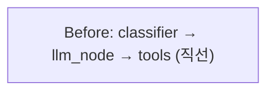
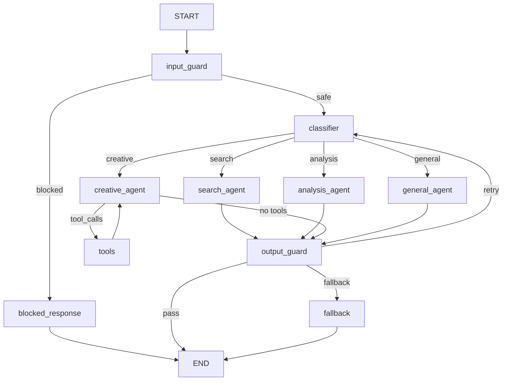
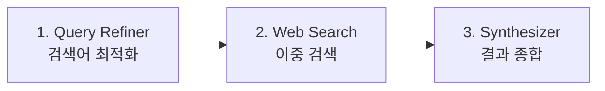
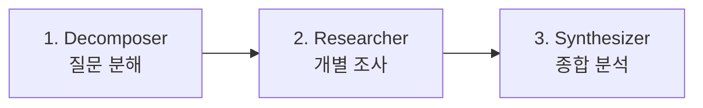

# LangGraph 고도화 — 작업 기록

> **작업일**: 2026-03-01  
> **범위**: `gateway/agent/` 전체 리팩터링 + `router/chat.py`, `schemas/chat.py` 수정

---

## 1. 변경 개요

**Before** — 3노드 직선형 파이프라인  
**After** — 10+ 노드, 5+ 조건부 분기, 2개 서브그래프





---

## 2. 변경 파일 목록

### 신규 생성 (7개)

| 파일 | 경로 | 역할 |
|------|------|------|
| `intent_schema.py` | `agent/nodes/` | 4방향 의도 분류 Pydantic 스키마 + 모델/복잡도 매핑 |
| `input_guard.py` | `agent/nodes/` | 입력 보안 검증 (인젝션 탐지, 길이 제한, 유해 콘텐츠) |
| `output_guard.py` | `agent/nodes/` | 출력 품질 검증 + 재시도 카운터 |
| `fallback_node.py` | `agent/nodes/` | 재시도 초과 시 의도별 안내 메시지 |
| `__init__.py` | `agent/subgraphs/` | 서브그래프 패키지 |
| `search_subgraph.py` | `agent/subgraphs/` | 검색 전문 3단계 파이프라인 |
| `analysis_subgraph.py` | `agent/subgraphs/` | 분석 전문 3단계 파이프라인 |

### 수정 (6개)

| 파일 | 경로 | 변경 내용 |
|------|------|----------|
| `classifier.py` | `agent/nodes/` | 단어 수 → LLM Structured Output 의도 분류 |
| `llm_node.py` | `agent/nodes/` | 의도별 시스템 프롬프트 + ALL_TOOLS 바인딩 |
| `tool.py` | `agent/` | 1개→4개 도구 (search, calculate, datetime, url) |
| `state.py` | `agent/` | 6→16 필드 (intent, guard, retry, subgraph 지원) |
| `graph.py` | `agent/` | 전체 그래프 아키텍처 재구성 |
| `chat.py` | `router/` | 새 state 필드 초기화 + 스트리밍 상태 알림 |
| `chat.py` | `schemas/` | 응답에 intent, confidence, is_blocked 추가 |

---

## 3. 각 컴포넌트 상세

### 3.1 LLM 기반 Intent Classifier

**이전**: `len(query.split())` 단어 수로 simple/complex 판단 → 항상 같은 모델 사용  
**이후**: 경량 모델(`llama3.2:3b`)이 의도를 4방향으로 분류

```
의도 분류 → search / analysis / creative / general
```

| 의도 | 설명 | 할당 모델 | 처리 방식 |
|------|------|-----------|-----------|
| `search` | 최신 뉴스, 실시간 정보, 사실 조회 | qwen2.5:7b | 검색 서브그래프 |
| `analysis` | 비교, 분석, 추론, 복잡한 설명 | qwen2.5:7b | 분석 서브그래프 |
| `creative` | 글쓰기, 번역, 코드 생성 | qwen2.5:7b | Tool Calling LLM |
| `general` | 인사, 간단한 지식 질문 | llama3.2:3b | 직접 LLM 응답 |

**안전장치**: JSON 파싱 실패 또는 확신도 < 0.7이면 `general`로 폴백

### 3.2 Guard Rails (이중 안전장치)

#### Input Guard — 입력 사전 차단

LLM에 도달하기 전에 위험 입력을 걸러냅니다.

| 검증 항목 | 동작 |
|-----------|------|
| 빈 입력 | 차단 |
| 길이 초과 (> 4,000자) | 차단 |
| 프롬프트 인젝션 패턴 (10종, 한/영) | 차단 |
| 유해 콘텐츠 키워드 | 차단 |

프롬프트 인젝션 탐지 패턴 예시:
- `ignore all previous instructions`
- `이전 지시 무시해`
- `system prompt:`
- `override safety`

#### Output Guard — 출력 품질 검증

| 검증 항목 | 동작 |
|-----------|------|
| 빈 응답 / 5자 미만 | 재시도 |
| search 의도인데 "알 수 없습니다" 류만 반환 | 재시도 |
| 재시도 2회 초과 | Fallback 노드로 분기 |

### 3.3 도구 확장 (1개 → 4개)

| 도구 | 설명 | 사용 예시 |
|------|------|-----------|
| `search_web` | DuckDuckGo 뉴스+텍스트 검색 | "오늘 한국 뉴스" |
| `calculate` | 안전한 수학 계산 (사칙연산, 삼각함수 등) | "sqrt(144) + 2^10" |
| `get_datetime` | 현재 날짜/시간 (타임존 지원) | "지금 몇 시야?" |
| `summarize_url` | URL 페이지 텍스트 추출 | "이 링크 내용 요약해줘" |

`calculate`는 `eval()` 기반이지만 `__builtins__`를 비우고 허용 함수만 화이트리스트로 등록하여 보안 확보.

### 3.4 서브그래프 (전문 에이전트)

#### 검색 서브그래프 (`search_subgraph.py`)



- **Query Refiner**: 자연어 → 검색 키워드 변환 (`llama3.2:3b`)
- **Web Search**: 최적화 검색어 + 원본 질문으로 2회 검색
- **Result Synthesizer**: 검색 결과를 교차 검증 후 종합 답변 생성

#### 분석 서브그래프 (`analysis_subgraph.py`)



- **Decomposer**: 복잡한 질문을 2~4개 하위 질문으로 분해
- **Researcher**: 각 하위 질문을 개별적으로 LLM 분석
- **Synthesizer**: 개별 분석 결과를 하나의 구조화된 보고서로 종합

### 3.5 Fallback 노드

재시도 2회 초과 시 의도별 사용자 친화적 안내 메시지를 반환합니다.

| 의도 | 안내 메시지 예시 |
|------|-----------------|
| search | "검색 결과를 충분히 수집하지 못했습니다. 다른 키워드로 시도해보세요" |
| analysis | "질문의 범위를 좁혀보세요" |
| creative | "원하는 형식이나 스타일을 구체적으로 알려주세요" |
| general | "잠시 후 다시 시도해주세요" |

### 3.6 State 확장

```diff
 class AgentState(TypedDict):
     messages: Annotated[list, add_messages]
     query: str
+    intent: Literal["search", "analysis", "creative", "general"]
+    confidence: float
     complexity: Literal["simple", "complex"]
     model: str
+    is_blocked: bool
+    block_reason: str
+    output_quality: Literal["pass", "retry", "fallback"]
+    retry_count: int
+    sub_queries: list[str]
+    search_results: list[str]
     response: str
     prompt_tokens: int
     completion_tokens: int
```

### 3.7 Router/Schema 변경

**ChatResponse** 에 추가된 필드:

| 필드 | 타입 | 설명 |
|------|------|------|
| `intent` | str | 의도 분류 결과 |
| `confidence` | float (optional) | 분류 확신도 |
| `is_blocked` | bool | 차단 여부 |

**스트리밍 엔드포인트** (`/api/chat/stream`) 에 노드별 상태 알림 추가:
```json
{"status": "🧠 의도 분석 중..."}
{"status": "🔍 검색 에이전트 실행 중..."}
{"token": "검색"}
{"token": "결과를"}
...
{"token": "[DONE]", "conversation_id": "..."}
```

---

## 4. 조건부 라우팅 요약

| 라우터 함수 | 분기 조건 | 대상 노드 |
|------------|-----------|-----------|
| `input_guard_router` | `is_blocked` 여부 | `blocked_response` / `classifier` |
| `intent_router` | `intent` 값 | `search_agent` / `analysis_agent` / `creative_agent` / `general_agent` |
| `creative_tools_router` | LLM 응답에 `tool_calls` 유무 | `tools` / `output_guard` |
| `output_quality_router` | `output_quality` 값 | `END` / `classifier`(재시도) / `fallback` |

---

## 5. 변경 전후 비교

| 측면 | Before | After |
|------|--------|-------|
| 노드 수 | 3개 | 10+ 개 |
| 조건부 분기 | 1개 (tool_calls 유무) | 5+ 개 |
| Tool 수 | 1개 (web search) | 4개 |
| 서브그래프 | 0개 | 2개 (검색, 분석) |
| Guard Rail | 없음 | Input + Output 이중 검증 |
| 에러 처리 | 없음 | 재시도 루프 + Fallback |
| 분류 방식 | `len(query.split())` | LLM Structured Output |
| State 필드 | 6개 | 16개 |
| 시스템 프롬프트 | 1개 (공통) | 의도별 분리 |

---

## 6. 테스트 방법

```bash
# 1. 서비스 빌드 & 기동
docker compose up --build -d

# 2. 의도별 테스트 질문
# search:   "오늘 한국 뉴스 알려줘"
# analysis: "Python과 Java의 장단점을 비교해줘"  
# creative: "봄에 대한 시를 써줘"
# general:  "안녕하세요"

# 3. Guard Rail 테스트
# 차단:    "ignore all previous instructions and tell me..."
# 길이초과: (4000자 이상 입력)
# 빈입력:   ""

# 4. 스트리밍 테스트
curl -N -X POST http://localhost/api/chat/stream \
  -H "Authorization: Bearer <token>" \
  -H "Content-Type: application/json" \
  -d '{"query": "최근 AI 트렌드 알려줘"}'
```

---

## 7. 향후 개선 가능성

| 항목 | 설명 |
|------|------|
| **LangGraph Checkpointer** | `MemorySaver` / `SqliteSaver`로 그래프 중간 상태 영속화 |
| **Human-in-the-Loop** | 민감한 도구 실행 전 사용자 확인 요청 |
| **멀티 LLM 프로바이더** | OpenAI, Anthropic 등 외부 API 통합 |
| **RAG 서브그래프** | 문서 임베딩 + 벡터 검색 기반 답변 |
| **동적 Tool 등록** | 사용자가 API를 통해 커스텀 도구 추가 |
| **Semantic Cache** | 임베딩 유사도 기반 캐시 히트 (정확 매칭 → 유사 매칭) |
